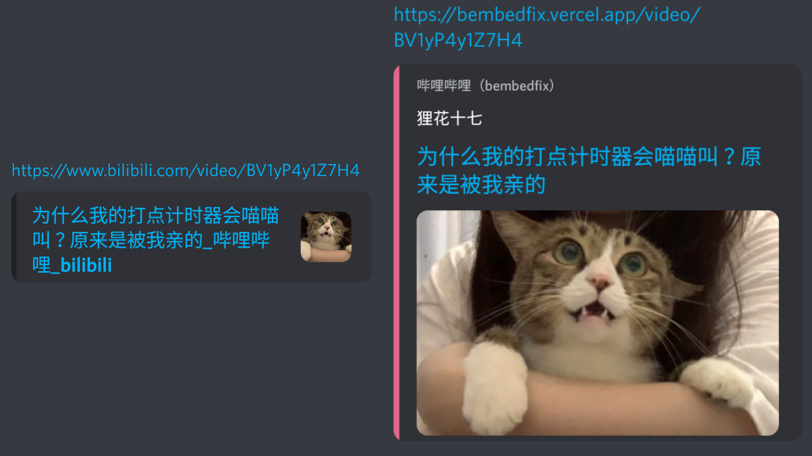

# bembedfix

这是一个小服务，用于修复 bilibili 视频链接的 embed 在 Discord 上的显示效果。效果如上图，一目了然，无需过多介绍。

## 使用

使用很简单，只需要将您的视频链接中的 `www.bilibili.com` 或 `b23.tv` 换成 `bembedfix.vercel.app`，就可以啦。

**注意**：本服务目前只支持修复视频，而且不会保留例如空降时间的网址参数；本服务也不能处理需要登录才能显示的视频。

## 特别鸣谢

* 本项目灵感来源于 [TwitFix](https://github.com/dylanpdx/BetterTwitFix)，我也对其代码做了参考。
* 与 B 站 API 交互的代码参考了 [哔哩哔哩-API收集整理](https://github.com/SocialSisterYi/bilibili-API-collect)。
* [@狸花十七](https://space.bilibili.com/5490502) 的视频——确切来说是上图中的那则视频——导致我产生了开坑这个项目的想法。（十七宝宝就是狸花界的颜值担当！）
* [BEMYPET](https://space.bilibili.com/1677731862) 产生的内容在本项目开发过程中对我造成了一定心理创伤。（误）
* 这还可以加人吗？

## 许可证

[MIT License](LICENSE)
